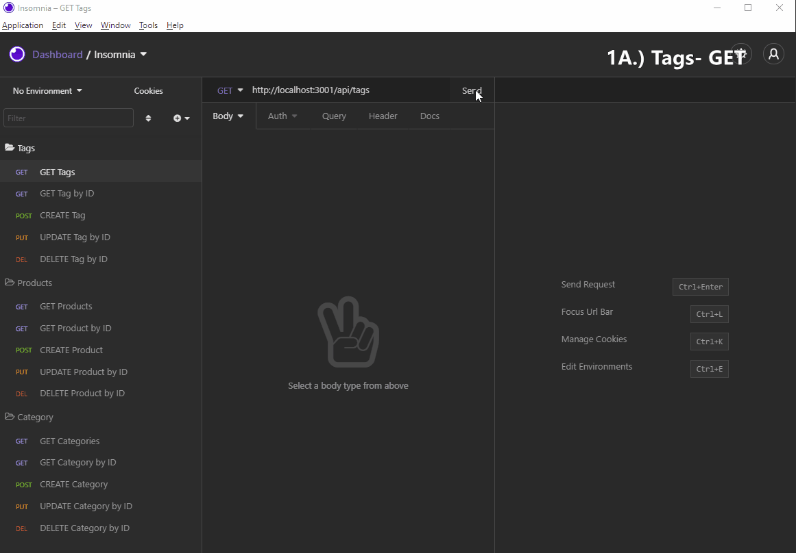
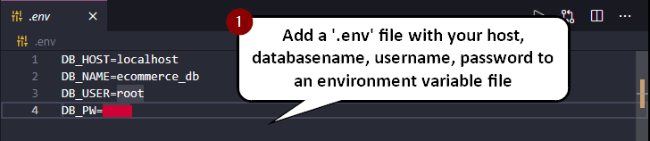
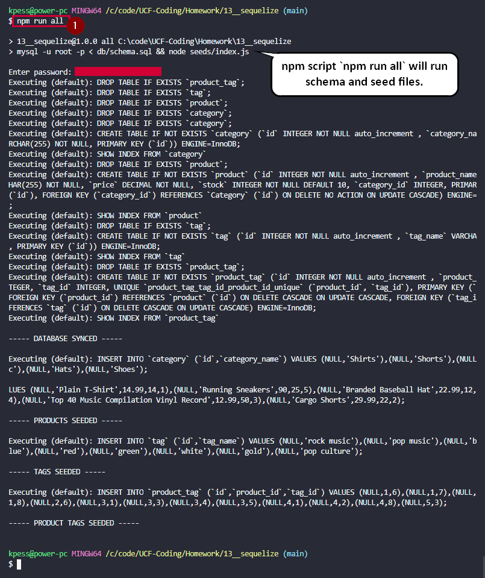
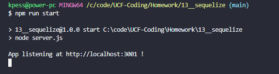

# sequelize-challenge

## **Description**

In this repository, I used a popular ORM (Object Relational Mapping) framework, Sequelize to create an Express-powered API backend for an e-commerce company. Tables of Products, Categories, and Tags are all related and CRUD (Create, Read, Update, Delete) api endpoints are programmed out to provide a robust backend for an e-commerce web application.

## **Table of Contents**
- [sequelize-challenge](#sequelize-challenge)
  - [**Description**](#description)
  - [**Table of Contents**](#table-of-contents)
  - [**Installation**](#installation)
  - [**Usage**](#usage)
  - [**License**](#license)
  - [**Contributing**](#contributing)
  - [**Questions**](#questions)

## **Installation**

Run <code>npm install</code> once repository is cloned or downloaded.

## **Usage**

1. First, you may need to add your `database name`, `MySQL username`, and `MySQL password` to an environment variable file.

2. run <code>npm run all</code> to both run the schema and seed the database.

3. Finally, run `npm run start` to start the express server.

## **License**

  
A short and simple permissive license with conditions only requiring preservation of copyright and license notices. Licensed works, modifications, and larger works may be distributed under different terms and without source code.

## **Contributing**

Feel free to contribute!

## **Questions**

Visit my [Github](http://www.github.com/kpessa) at github.com/kpessa

